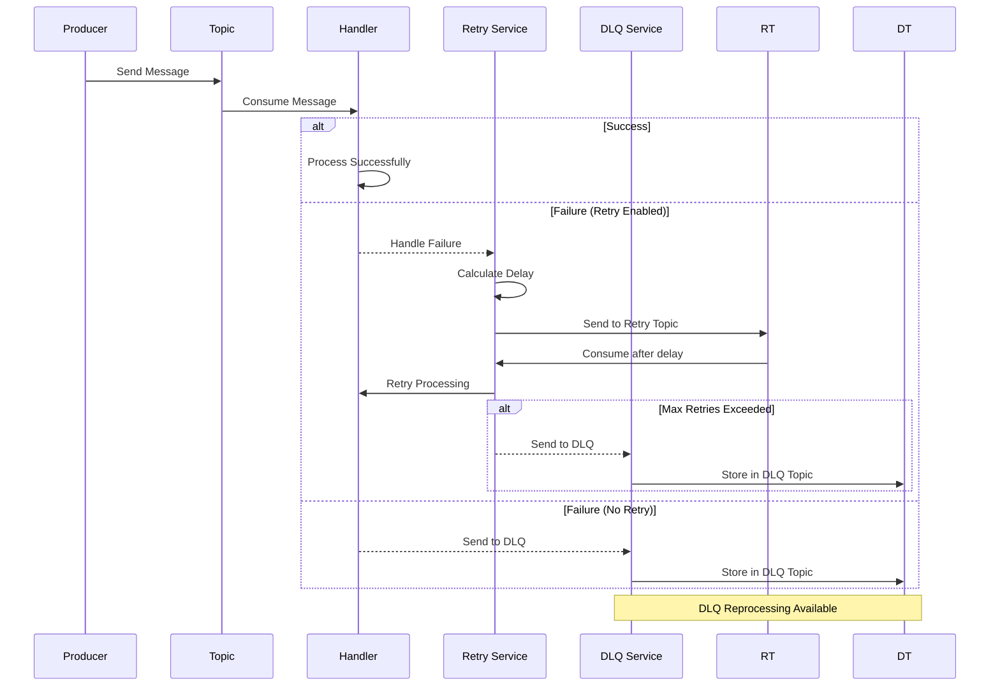
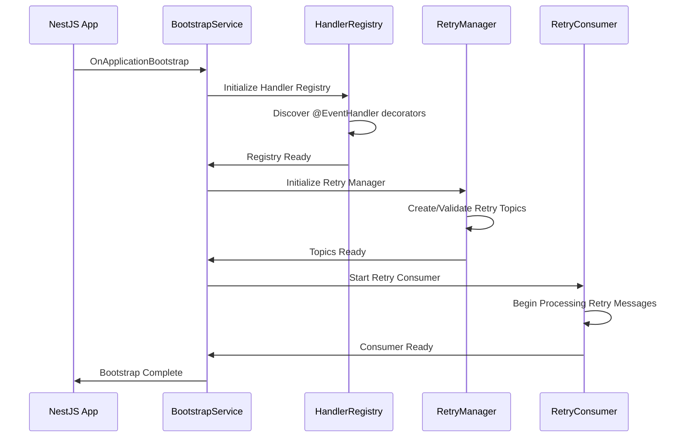
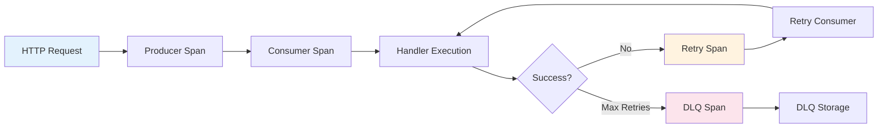

# @torix/nestjs-kafka

[](https://badge.fury.io/js/%40torix%2Fnestjs-kafka)
[](https://opensource.org/licenses/MIT)
[](https://github.com/torix/nestjs-kafka/actions)
[](https://coveralls.io/github/torix/nestjs-kafka?branch=main)
[](https://www.typescriptlang.org/)
[](https://nestjs.com/)

A **production-ready**, simplified NestJS Kafka events package with built-in retry mechanisms and Dead Letter Queue (DLQ) support. Designed for enterprise applications requiring reliable message processing with minimal configuration.

## ✨ Key Features

- **🚀 Zero-Configuration Start** - Works out-of-the-box with sensible defaults
- **🔄 Smart Retry Mechanism** - Exponential/linear backoff with timestamp-based delay processing
- **💀 Dead Letter Queue** - Automatic DLQ storage and reprocessing capabilities
- **📊 Production Monitoring** - Built-in metrics, health checks, and REST APIs
- **🏗️ Enterprise Architecture** - Centralized bootstrap, handler registry, and message processing
- **🛡️ Type Safety** - Full TypeScript support with strict typing
- **🔧 Flexible Configuration** - Environment-based configuration with validation
- **📈 Scalable Design** - Handles high-throughput scenarios with proper offset management
- **🔍 OpenTelemetry Integration** - Built-in distributed tracing with KafkaJS auto-instrumentation
- **🔗 Automatic Correlation ID Propagation** - Zero-config correlation tracking across message flows

## 📋 Table of Contents

- [Installation](#installation)
- [Quick Start](#quick-start)
- [Architecture](#architecture)
- [Configuration](#configuration)
- [OpenTelemetry & Tracing](#opentelemetry--tracing)
- [Usage Examples](#usage-examples)
- [API Reference](#api-reference)
- [Monitoring & Operations](#monitoring--operations)
- [Testing](#testing)
- [Troubleshooting](#troubleshooting)
- [Migration Guide](#migration-guide)
- [Contributing](#contributing)

## 📦 Installation

```bash
npm install @torix/nestjs-kafka kafkajs
```

**Dependencies:**
- `kafkajs`: The underlying Kafka client
- `@nestjs/common`: NestJS core (peer dependency)
- `@nestjs/microservices`: For microservice support (peer dependency)

## 🚀 Quick Start

### 1. Basic Module Setup

```typescript
import { Module } from '@nestjs/common';
import { KafkaModule } from '@torix/nestjs-kafka';

@Module({
  imports: [
    KafkaModule.forRoot({
      client: {
        clientId: 'my-service',
        brokers: ['localhost:9092'],
      },
      consumer: {
        groupId: 'my-service-group',
      },
      retry: {
        enabled: true,
        attempts: 3,
        baseDelay: 2000,
        maxDelay: 30000,
        backoff: 'exponential',
      },
      dlq: {
        enabled: true,
      },
    }),
  ],
})
export class AppModule {}
```

### 2. Create Event Handlers

```typescript
import { Injectable } from '@nestjs/common';
import { EventHandler } from '@torix/nestjs-kafka';

@Injectable()
export class OrderService {
  @EventHandler('order.created', {
    retry: {
      enabled: true,
      attempts: 3,
      backoff: 'exponential',
    },
  })
  async handleOrderCreated(payload: OrderCreatedEvent) {
    console.log('Processing order:', payload);
    // Your business logic here
    if (payload.shouldFail) {
      throw new Error('Simulated processing failure');
    }
  }

  @EventHandler('user.registered')
  async handleUserRegistered(payload: UserRegisteredEvent) {
    console.log('User registered:', payload);
    // This handler uses global retry configuration
  }
}
```

### 3. Produce Messages

```typescript
import { Injectable } from '@nestjs/common';
import { KafkaProducerService } from '@torix/nestjs-kafka';

@Injectable()
export class OrderProducerService {
  constructor(private readonly producer: KafkaProducerService) {}

  async publishOrderCreated(order: Order): Promise<void> {
    await this.producer.send('order.created', {
      key: order.id,
      value: order,
      headers: {
        'source': 'order-service',
        'version': '1.0.0',
      },
    });
  }
}
```

## 🏗️ Architecture

### System Architecture

```mermaid
graph TB
    A[KafkaModule] --> B[KafkaBootstrapService]
    A --> C[KafkaHandlerRegistry]
    A --> D[KafkaProducerService]
    A --> E[KafkaRetryService]
    A --> F[KafkaDlqService]

    B --> G[Initialization Coordinator]
    C --> H[Handler Discovery]
    C --> I[@EventHandler Decorators]

    E --> J[Retry Topic Management]
    E --> K[Retry Consumer]
    E --> L[Exponential Backoff]

    F --> M[DLQ Topic Management]
    F --> N[Message Storage]
    F --> O[Reprocessing API]

    style A fill:#e1f5fe
    style E fill:#f3e5f5
    style F fill:#fff3e0
```

### Message Flow Diagram



### Bootstrap Sequence



## 🏗️ Architecture

This package provides a **complete Kafka solution** with a **single Kafka instance** that handles all operations: consumption, production, retry, and DLQ management. No need for NestJS microservices configuration.

### How It Works

1. **Single Kafka Instance**: One KafkaJS client handles all operations
2. **KafkaModule**: Manages complete Kafka lifecycle including consumption
3. **@EventHandler Decorator**: Registers handlers for topic message processing
4. **Bootstrap Service**: Coordinates initialization sequence

### Architecture Components

| Component | Responsibility |
|-----------|----------------|
| **KafkaModule** | Single source of Kafka configuration and management |
| **KafkaConsumerService** | Handles topic subscriptions and message consumption |
| **KafkaProducerService** | Handles message publishing and retry/DLQ sending |
| **KafkaRetryService** | Manages retry topics and delayed processing |
| **KafkaDlqService** | Manages dead letter queue topics and reprocessing |
| **KafkaBootstrapService** | Coordinates initialization order |

### Key Benefits

- **True Single Instance**: One Kafka client for all operations
- **No Microservice Setup**: No need for `app.connectMicroservice()`
- **Unified Configuration**: All Kafka settings in one place
- **Simplified Architecture**: Module handles everything internally
- **Zero Configuration Conflicts**: No duplicate client/consumer settings

### Example Setup

```typescript
// app.module.ts - Complete Kafka configuration
@Module({
  imports: [
    KafkaModule.forRoot({
      client: {
        clientId: 'my-service',
        brokers: ['localhost:9092']
      },
      consumer: {
        groupId: 'my-service-group'
      },
      subscriptions: {
        topics: ['user.created', 'order.processed'],
        fromBeginning: false
      },
      retry: { enabled: true, attempts: 3 },
      dlq: { enabled: true }
    })
  ],
  controllers: [MyController],
})
export class AppModule {}

// main.ts - No microservice setup needed!
const app = await NestFactory.create(AppModule);
await app.listen(3000); // That's it!
```

### Migration from Previous Version

If you were using the dual-instance architecture:

**Before:**
```typescript
// main.ts
app.connectMicroservice({ transport: Transport.KAFKA, ... });

// app.module.ts
KafkaModule.forRoot({ client: ..., retry: ... }) // Producer only
```

**After:**
```typescript
// main.ts - Remove connectMicroservice!
await app.listen(3000);

// app.module.ts - Add subscriptions
KafkaModule.forRoot({
  client: ...,
  consumer: ...,
  subscriptions: { topics: [...] },
  retry: ...
})
```

## ⚙️ Configuration

### Configuration Interface

```typescript
export interface KafkaModuleOptions {
  client: {
    clientId: string;
    brokers: string[];
    ssl?: boolean;
    sasl?: {
      mechanism: 'plain' | 'scram-sha-256' | 'scram-sha-512';
      username: string;
      password: string;
    };
  };
  consumer: {
    groupId: string;
    sessionTimeout?: number;
    heartbeatInterval?: number;
    // ... other KafkaJS consumer options
  };
  producer?: {
    // KafkaJS producer configuration options
    maxInFlightRequests?: number;
    idempotent?: boolean;
    transactionTimeout?: number;
  };
  subscriptions: {
    topics: string[];
    fromBeginning?: boolean;
  };
  retry?: {
    enabled: boolean;
    attempts: number;
    baseDelay: number;
    maxDelay: number;
    backoff: 'exponential' | 'linear';
    topicPartitions?: number;
    topicReplicationFactor?: number;
    topicRetentionMs?: number;
    topicSegmentMs?: number;
  };
  dlq?: {
    enabled: boolean;
    topicPartitions?: number;
    topicReplicationFactor?: number;
    topicRetentionMs?: number;
  };
}
```

### Environment-Based Configuration

```typescript
import { ConfigService } from '@nestjs/config';

@Module({
  imports: [
    KafkaModule.forRootAsync({
      useFactory: async (configService: ConfigService) => ({
        client: {
          clientId: configService.get<string>('KAFKA_CLIENT_ID'),
          brokers: configService.get<string>('KAFKA_BROKERS').split(','),
          ssl: configService.get<boolean>('KAFKA_SSL_ENABLED', false),
        },
        consumer: {
          groupId: configService.get<string>('KAFKA_CONSUMER_GROUP'),
        },
        subscriptions: {
          topics: configService.get<string>('KAFKA_TOPICS').split(','),
          fromBeginning: configService.get<boolean>('KAFKA_FROM_BEGINNING', false),
        },
        retry: {
          enabled: configService.get<boolean>('KAFKA_RETRY_ENABLED', true),
          attempts: configService.get<number>('KAFKA_RETRY_ATTEMPTS', 3),
          baseDelay: configService.get<number>('KAFKA_RETRY_BASE_DELAY', 2000),
          maxDelay: configService.get<number>('KAFKA_RETRY_MAX_DELAY', 30000),
          backoff: configService.get<'exponential' | 'linear'>('KAFKA_RETRY_BACKOFF', 'exponential'),
        },
        dlq: {
          enabled: configService.get<boolean>('KAFKA_DLQ_ENABLED', true),
        },
      }),
      inject: [ConfigService],
    }),
  ],
})
export class AppModule {}
```

### Cloud Kafka Configuration (Confluent, Redpanda, AWS MSK)

The package provides **automatic SASL + SSL configuration** for cloud Kafka providers with zero boilerplate.

#### Simple Configuration (Recommended)

Set environment variables and the package handles the rest:

```bash
# .env
KAFKA_BROKERS=pkc-xxxxx.us-east-1.aws.confluent.cloud:9092
KAFKA_SASL_MECHANISM=plain  # or scram-sha-256, scram-sha-512
KAFKA_SASL_USERNAME=your-api-key
KAFKA_SASL_PASSWORD=your-api-secret
# KAFKA_SSL_ENABLED is optional - automatically enabled when SASL is configured
```

```typescript
@Module({
  imports: [
    KafkaModule.forRoot({
      client: {
        brokers: process.env.KAFKA_BROKERS.split(','),
        // SASL and SSL are automatically configured from environment variables
      },
      consumer: {
        groupId: 'my-consumer-group',
      },
    }),
  ],
})
export class AppModule {}
```

**That's it!** The package automatically:
- ✅ Reads SASL credentials from `KAFKA_SASL_*` environment variables
- ✅ Enables SSL when SASL is configured (unless explicitly disabled)
- ✅ Normalizes SASL mechanism to lowercase
- ✅ Allows explicit overrides when needed

#### Supported Cloud Providers

**Confluent Cloud:**
```bash
KAFKA_BROKERS=pkc-xxxxx.us-east-1.aws.confluent.cloud:9092
KAFKA_SASL_MECHANISM=plain
KAFKA_SASL_USERNAME=<API_KEY>
KAFKA_SASL_PASSWORD=<API_SECRET>
```

**Redpanda Cloud:**
```bash
KAFKA_BROKERS=seed-xxxxx.redpanda.cloud:9092
KAFKA_SASL_MECHANISM=scram-sha-256
KAFKA_SASL_USERNAME=<USERNAME>
KAFKA_SASL_PASSWORD=<PASSWORD>
```

**AWS MSK (SASL/SCRAM):**
```bash
KAFKA_BROKERS=b-1.mycluster.xxx.kafka.amazonaws.com:9092
KAFKA_SASL_MECHANISM=scram-sha-512
KAFKA_SASL_USERNAME=<USERNAME>
KAFKA_SASL_PASSWORD=<PASSWORD>
```

#### Explicit Configuration (Alternative)

If you prefer explicit configuration or need special settings:

```typescript
@Module({
  imports: [
    KafkaModule.forRootAsync({
      useFactory: (config: ConfigService) => ({
        client: {
          brokers: config.get('KAFKA_BROKERS').split(','),
          ssl: true,  // Explicitly enable SSL
          sasl: {
            mechanism: 'scram-sha-256',
            username: config.get('KAFKA_SASL_USERNAME'),
            password: config.get('KAFKA_SASL_PASSWORD'),
          },
        },
        consumer: {
          groupId: 'my-consumer-group',
        },
      }),
      inject: [ConfigService],
    }),
  ],
})
export class AppModule {}
```

#### Configuration Precedence

The package follows this precedence order:
1. **Explicit config** - Values you provide in `KafkaModule.forRoot()` always win
2. **Environment variables** - Automatic fallback using `KAFKA_SASL_*` and `KAFKA_SSL_ENABLED`
3. **Smart defaults** - SSL automatically enabled when SASL is configured

#### Disabling Smart Defaults

To use SASL **without** SSL (not recommended for production):

```typescript
KafkaModule.forRoot({
  client: {
    brokers: ['localhost:9092'],
    ssl: false,  // Explicit override prevents auto-enabling SSL
    // SASL config from env will still be applied
  },
})
```

### Microservice Setup

```typescript
// main.ts
import { NestFactory } from '@nestjs/core';
import { Transport } from '@nestjs/microservices';
import { AppModule } from './app.module';

async function bootstrap() {
  const app = await NestFactory.create(AppModule);

  // Register Kafka microservice
  app.connectMicroservice({
    transport: Transport.KAFKA,
    options: {
      client: {
        clientId: 'my-service',
        brokers: ['localhost:9092'],
      },
      consumer: {
        groupId: 'my-service-group',
      },
      subscribe: {
        topics: ['order.created', 'user.registered'],
        fromBeginning: false,
      },
    },
  });

  await app.startAllMicroservices();
  await app.listen(3000);
}
bootstrap();
```

## 🔍 OpenTelemetry & Tracing

The package provides built-in support for **OpenTelemetry distributed tracing** with automatic **correlation ID propagation**. It seamlessly integrates with KafkaJS auto-instrumentation while adding custom spans for retry and DLQ operations.

### 🚀 Zero-Configuration Tracing

The package automatically handles correlation ID propagation without requiring manual setup:

```typescript
import { Injectable } from '@nestjs/common';
import { KafkaProducerService } from '@torix/nestjs-kafka';

@Injectable()
export class OrderService {
  constructor(private readonly producer: KafkaProducerService) {}

  async createOrder(order: Order): Promise<void> {
    // Correlation ID is automatically generated and propagated
    await this.producer.send('order.created', {
      key: order.id,
      value: order,
      // No need to manually manage correlation IDs!
    });
  }

  // Optional: Provide explicit correlation ID
  async createOrderWithCorrelation(order: Order, correlationId: string): Promise<void> {
    await this.producer.send('order.created', {
      key: order.id,
      value: order,
      correlationId, // Explicitly provided correlation ID
    });
  }
}
```

### 📡 OpenTelemetry Setup

Install OpenTelemetry dependencies for your application:

```bash
npm install @opentelemetry/api @opentelemetry/sdk-node @opentelemetry/auto-instrumentations-node
```

Create a tracing setup file (`src/tracing.ts`):

```typescript
import { NodeSDK } from '@opentelemetry/sdk-node';
import { ConsoleSpanExporter } from '@opentelemetry/sdk-trace-node';
import { getNodeAutoInstrumentations } from '@opentelemetry/auto-instrumentations-node';
import { Resource } from '@opentelemetry/resources';
import { ATTR_SERVICE_NAME, ATTR_SERVICE_VERSION } from '@opentelemetry/semantic-conventions';

// Initialize OpenTelemetry
const sdk = new NodeSDK({
  resource: new Resource({
    [ATTR_SERVICE_NAME]: 'my-kafka-service',
    [ATTR_SERVICE_VERSION]: '1.0.0',
  }),
  traceExporter: new ConsoleSpanExporter(), // Use OTLP exporter in production
  instrumentations: [
    getNodeAutoInstrumentations({
      // Enable KafkaJS instrumentation
      '@opentelemetry/instrumentation-kafkajs': {
        enabled: true,
      },
      // Enable HTTP instrumentation for REST APIs
      '@opentelemetry/instrumentation-http': {
        enabled: true,
      },
      // Disable fs instrumentation to reduce noise
      '@opentelemetry/instrumentation-fs': {
        enabled: false,
      },
    }),
  ],
});

// Start the SDK
sdk.start();
console.log('🔍 OpenTelemetry tracing initialized');

// Graceful shutdown
process.on('SIGTERM', () => {
  sdk.shutdown()
    .then(() => console.log('✅ OpenTelemetry terminated'))
    .catch((error) => console.log('❌ Error terminating OpenTelemetry', error))
    .finally(() => process.exit(0));
});

export default sdk;
```

Import tracing at the very beginning of your `main.ts`:

```typescript
// Initialize tracing BEFORE any other imports
import './tracing';

import { NestFactory } from '@nestjs/core';
import { AppModule } from './app.module';

async function bootstrap() {
  const app = await NestFactory.create(AppModule);
  // ... rest of your bootstrap
}
bootstrap();
```

### 🔗 Trace Context Flow

The package creates a complete trace context that flows through all operations:



**Automatic Spans Created:**
- **HTTP Request Spans** (via `@opentelemetry/instrumentation-http`)
- **Kafka Producer Spans** (via `@opentelemetry/instrumentation-kafkajs`)
- **Kafka Consumer Spans** (via `@opentelemetry/instrumentation-kafkajs`)
- **Custom Retry Spans** (by this package)
- **Custom DLQ Spans** (by this package)

### 📊 Trace Attributes

Each span includes comprehensive attributes for observability:

**Producer Spans:**
```typescript
{
  'messaging.system': 'kafka',
  'messaging.destination': 'order.created',
  'messaging.destination_kind': 'topic',
  'messaging.kafka.message_key': 'order-123',
  'x-correlation-id': 'corr-abc123-1234567890'
}
```

**Retry Spans:**
```typescript
{
  'messaging.system': 'kafka',
  'messaging.destination': 'order.created',
  'kafka.handler_id': 'OrderService.handleOrderCreated',
  'messaging.kafka.retry_count': 2,
  'kafka.retry.delay_ms': 4000,
  'kafka.operation': 'retry'
}
```

**DLQ Spans:**
```typescript
{
  'messaging.system': 'kafka',
  'messaging.destination': 'order.created',
  'kafka.handler_id': 'OrderService.handleOrderCreated',
  'messaging.kafka.retry_count': 3,
  'kafka.operation': 'dlq_store'
}
```

### 🎯 Correlation ID Management

The package provides intelligent correlation ID handling with multiple fallback strategies:

```typescript
// 1. Explicit correlation ID (highest priority)
await producer.send('topic', {
  value: data,
  correlationId: 'explicit-correlation-id'
});

// 2. Header-based correlation ID (backward compatibility)
await producer.send('topic', {
  value: data,
  headers: {
    'x-correlation-id': 'header-correlation-id'
  }
});

// 3. Auto-generated correlation ID (fallback)
await producer.send('topic', {
  value: data
  // Correlation ID automatically generated: 'corr-{random}-{timestamp}'
});
```

### 🔧 Tracing Utilities

The package exports tracing utilities for advanced use cases:

```typescript
import {
  getCorrelationId,
  getOrGenerateCorrelationId,
  createRetrySpan,
  createDlqSpan,
  executeWithSpan,
  setSpanError
} from '@torix/nestjs-kafka';

// Extract correlation ID from headers
const correlationId = getCorrelationId(headers);

// Create custom spans for business logic
const span = createRetrySpan('order.created', 'OrderService.handleOrderCreated', 2, 4000);

// Execute code within span context
await executeWithSpan(span, async () => {
  // Your code here
  throw new Error('Something went wrong');
});
```

### 🏭 Production Configuration

For production environments, configure proper trace exporters:

```typescript
// Production tracing setup
import { NodeSDK } from '@opentelemetry/sdk-node';
import { OTLPTraceExporter } from '@opentelemetry/exporter-otlp-http';

const sdk = new NodeSDK({
  resource: new Resource({
    [ATTR_SERVICE_NAME]: process.env.SERVICE_NAME || 'kafka-service',
    [ATTR_SERVICE_VERSION]: process.env.SERVICE_VERSION || '1.0.0',
    [ATTR_DEPLOYMENT_ENVIRONMENT]: process.env.NODE_ENV || 'production',
  }),
  traceExporter: new OTLPTraceExporter({
    url: process.env.OTLP_TRACE_ENDPOINT || 'http://jaeger:14268/api/traces',
    headers: {
      'Authorization': `Bearer ${process.env.OTLP_TOKEN}`,
    },
  }),
  instrumentations: [getNodeAutoInstrumentations()],
});
```

### 📈 Observability Benefits

With OpenTelemetry integration, you get:

- **End-to-End Tracing**: Follow requests from HTTP to Kafka to retry to DLQ
- **Performance Monitoring**: Identify bottlenecks in message processing
- **Error Tracking**: Correlate failures across retry attempts
- **Service Dependencies**: Visualize Kafka topic relationships
- **Correlation Tracking**: Link related operations across microservices

### 🔍 Example Trace Flow

Here's what a complete trace looks like:

```
HTTP POST /orders
├── http_request (span)
│   ├── kafka_producer (span) - topic: order.created
│   │   └── kafka_consumer (span) - topic: order.created
│   │       ├── order_processing (span) - FAILED
│   │       └── kafka_retry (span) - attempt 1, delay: 2s
│   │           └── kafka_consumer (span) - topic: __retry_topic
│   │               ├── order_processing (span) - FAILED
│   │               └── kafka_retry (span) - attempt 2, delay: 4s
│   │                   └── kafka_consumer (span) - topic: __retry_topic
│   │                       ├── order_processing (span) - FAILED
│   │                       └── kafka_dlq_store (span) - stored to DLQ
└── All spans share the same trace ID and correlation ID
```

## 💡 Usage Examples

### Handler with Custom Retry Configuration

```typescript
@Injectable()
export class PaymentService {
  @EventHandler('payment.process', {
    retry: {
      enabled: true,
      attempts: 5,
      baseDelay: 5000,
      maxDelay: 60000,
      backoff: 'exponential',
    },
  })
  async processPayment(payload: PaymentEvent) {
    try {
      await this.externalPaymentGateway.charge(payload);
    } catch (error) {
      if (error.code === 'TEMPORARY_FAILURE') {
        throw error; // Will retry
      }
      // Log and don't retry for permanent failures
      this.logger.error('Permanent payment failure', error);
      return; // Success (don't retry)
    }
  }
}
```

### DLQ Message Reprocessing

DLQ reprocessing is topic-specific and uses persistent consumer groups to avoid re-reading the entire DLQ.

```typescript
@Injectable()
export class DlqManagementService {
  constructor(private readonly dlqService: KafkaDlqService) {}

  async reprocessFailedOrders(): Promise<void> {
    // Reprocess DLQ messages for a specific topic
    // Each topic uses its own consumer group to track progress
    await this.dlqService.startReprocessing({
      topic: 'order.created',  // Required: topic to reprocess
      batchSize: 50,
      timeoutMs: 30000,
      stopOnError: false,
    });
  }

  async reprocessUserEvents(): Promise<void> {
    // Reprocess user-related events from DLQ
    await this.dlqService.startReprocessing({
      topic: 'user.updated',
      batchSize: 100,
      timeoutMs: 60000,
    });
  }

  async getDlqStatus(): Promise<any> {
    return {
      topic: this.dlqService.getDlqTopicName(),
      active: this.dlqService.isReprocessingActive(),
      metrics: this.dlqService.getMetrics(),
    };
  }
}
```

**How it works:**
- Each topic gets its own persistent consumer group: `{service}.dlq.reprocess.{topic}`
- Consumer groups maintain independent offsets, so each topic's reprocessing starts where it left off
- Non-matching messages are safely skipped without reprocessing the entire DLQ
- Use via monitoring API: `POST /kafka/dlq/reprocess` with `{ "topic": "order.created" }`

### Message Production with Headers

```typescript
@Injectable()
export class NotificationService {
  constructor(private readonly producer: KafkaProducerService) {}

  async sendOrderConfirmation(order: Order): Promise<void> {
    await this.producer.send('notification.send', {
      key: order.customerId,
      value: {
        type: 'order_confirmation',
        orderId: order.id,
        customerEmail: order.customerEmail,
        items: order.items,
      },
      correlationId: order.correlationId, // Explicit correlation ID
      headers: {
        'source-service': 'order-service',
        'event-version': '2.0',
        'timestamp': new Date().toISOString(),
      },
    });
  }

  async sendBatch(notifications: Notification[]): Promise<void> {
    const messages = notifications.map(notification => ({
      key: notification.userId,
      value: notification,
      headers: {
        'batch-id': generateBatchId(),
        'source-service': 'notification-service',
      },
    }));

    await this.producer.sendBatch('notification.send', messages);
  }
}
```

### Error Handling Patterns

```typescript
@Injectable()
export class OrderProcessingService {
  private readonly logger = new Logger(OrderProcessingService.name);

  @EventHandler('order.created')
  async handleOrderCreated(payload: OrderEvent, context: any) {
    const headers = context.getMessage().headers;
    const retryCount = parseInt(headers['x-retry-count'] || '0', 10);

    try {
      await this.processOrder(payload);
      this.logger.log(`Order processed successfully: ${payload.orderId}`);
    } catch (error) {
      this.logger.error(
        `Order processing failed (attempt ${retryCount + 1}): ${payload.orderId}`,
        error.stack,
      );

      if (this.isPermanentError(error)) {
        this.logger.warn(`Permanent error detected for order: ${payload.orderId}`);
        // Don't throw - this prevents retry
        await this.handlePermanentFailure(payload, error);
        return;
      }

      // Temporary error - will be retried
      throw error;
    }
  }

  private isPermanentError(error: Error): boolean {
    return error.message.includes('INVALID_ORDER') ||
           error.message.includes('CUSTOMER_NOT_FOUND');
  }

  private async handlePermanentFailure(payload: OrderEvent, error: Error): Promise<void> {
    // Send to alternative processing or alerting
    await this.alertingService.sendAlert({
      type: 'PERMANENT_ORDER_FAILURE',
      orderId: payload.orderId,
      error: error.message,
    });
  }
}
```

## 📚 API Reference

### Decorators

#### @EventHandler(pattern, options?)

Marks a method as a Kafka event handler with optional retry and DLQ configuration.

```typescript
@EventHandler(pattern: string, options?: EventHandlerOptions)

interface EventHandlerOptions {
  retry?: {
    enabled?: boolean;
    attempts?: number;
    baseDelay?: number;
    maxDelay?: number;
    backoff?: 'exponential' | 'linear';
  };
}
```

#### @SimpleEventHandler(pattern)

Marks a method as a simple Kafka event handler without retry/DLQ support.

```typescript
@SimpleEventHandler(pattern: string)
```

### Services

#### KafkaProducerService

Service for sending messages to Kafka topics.

```typescript
class KafkaProducerService {
  async send(topic: string, message: MessagePayload): Promise<RecordMetadata[]>
  async sendBatch(topic: string, messages: MessagePayload[]): Promise<RecordMetadata[]>
}

interface MessagePayload {
  key?: string;
  value: any;
  headers?: Record<string, string>;
  partition?: number;
  timestamp?: string;
  /** Optional correlation ID for tracing. If not provided, one will be auto-generated. */
  correlationId?: string;
}
```

#### KafkaDlqService

Service for managing Dead Letter Queue operations.

```typescript
class KafkaDlqService {
  getDlqTopicName(): string
  isReprocessingActive(): boolean
  getMetrics(): DlqMetrics
  async startReprocessing(options: DlqReprocessingOptions): Promise<void>
  async stopReprocessing(): Promise<void>
}

interface DlqReprocessingOptions {
  topic: string;           // Required: specific topic to reprocess from DLQ
  batchSize?: number;      // Default: 100
  timeoutMs?: number;      // Default: 30000
  stopOnError?: boolean;   // Default: false
}
```

#### KafkaRetryService

Service for managing retry operations and metrics.

```typescript
class KafkaRetryService {
  async getMetrics(): Promise<RetryMetrics>
  async getRetryTopicInfo(): Promise<TopicInfo>
}

interface RetryMetrics {
  messagesProcessed: number;
  messagesDelayed: number;
  messagesSkipped: number;
  errorsEncountered: number;
}
```

### Interfaces

#### KafkaModuleOptions

Complete configuration interface for the Kafka module.

#### EventHandlerOptions

Configuration options for individual event handlers.

#### DlqMessageHeaders

Headers included in DLQ messages for tracking and reprocessing.

```typescript
interface DlqMessageHeaders {
  'x-original-topic': string;
  'x-handler-id': string;
  'x-retry-count': string;
  'x-error-message': string;
  'x-failed-at': string;
  'x-dlq-stored-at': string;
}
```

## 📊 Monitoring & Operations

The package **automatically registers** a monitoring controller for health checks, metrics, and operations.

### Automatic Setup (Default)

The monitoring controller is enabled by default and registers endpoints at `/kafka/*`:

```typescript
@Module({
  imports: [KafkaModule.forRoot({ /* kafka config */ })],
  // KafkaMonitoringController is automatically registered!
})
export class AppModule {}
```

### Disabling Monitoring (Optional)

To disable the monitoring controller:

```typescript
@Module({
  imports: [
    KafkaModule.forRoot({
      // ... kafka config
      monitoring: {
        enabled: false, // Disable monitoring endpoints
      },
    }),
  ],
})
export class AppModule {}
```

### Available Endpoints

```typescript
// Health check
GET /kafka/health
Response: {
  status: "healthy",
  timestamp: "2025-09-29T10:30:00.000Z",
  components: {
    producer: { connected: true },
    retry: { running: true },
    dlq: { reprocessing: false },
    handlers: { registered: 15 }
  }
}

// Kubernetes readiness
GET /kafka/health/ready
Response: {
  ready: true,
  checks: {
    producer: true,
    handlers: true
  }
}

// Kubernetes liveness
GET /kafka/health/live
Response: {
  alive: true,
  timestamp: "2025-09-29T10:30:00.000Z"
}
```

```typescript
// Metrics
GET /kafka/metrics
Response: {
  timestamp: "2025-09-29T10:30:00.000Z",
  handlers: {
    registered: 15,
    patterns: ["user.created", "order.placed"]
  },
  retry: {
    topic: "my-service.retry",
    running: true,
    messagesProcessed: 1234,
    messagesSkipped: 56,
    messagesDelayed: 89,
    errorsEncountered: 12
  },
  dlq: {
    topic: "my-service.dlq",
    reprocessing: false,
    messagesStored: 45,
    messagesReprocessed: 23
  }
}

// List handlers
GET /kafka/handlers
Response: {
  total: 15,
  handlers: [
    {
      id: "UserController.handleUserCreated",
      pattern: "user.created",
      method: "handleUserCreated",
      class: "UserController",
      options: { retry: { enabled: true, attempts: 3 } }
    }
  ]
}

// DLQ operations - reprocess specific topic
POST /kafka/dlq/reprocess
Body: {
  topic: "order.created",      // Required: topic to reprocess
  batchSize: 100,              // Optional
  timeoutMs: 30000,            // Optional
  stopOnError: false           // Optional
}
Response: {
  success: true,
  message: "DLQ reprocessing started for topic: order.created"
}

POST /kafka/dlq/stop
Response: {
  success: true,
  message: "DLQ reprocessing stopped"
}

// Reset metrics
POST /kafka/metrics/reset?component=all
```

### Kubernetes Integration

```yaml
livenessProbe:
  httpGet:
    path: /kafka/health/live
    port: 3000
readinessProbe:
  httpGet:
    path: /kafka/health/ready
    port: 3000
```

### Prometheus Integration

```typescript
import { PrometheusModule } from '@willsoto/nestjs-prometheus';
import { Counter, Histogram } from 'prom-client';

@Injectable()
export class MetricsService {
  private readonly messageProcessedCounter = new Counter({
    name: 'kafka_messages_processed_total',
    help: 'Total number of Kafka messages processed',
    labelNames: ['topic', 'handler', 'status'],
  });

  private readonly messageProcessingDuration = new Histogram({
    name: 'kafka_message_processing_duration_seconds',
    help: 'Time spent processing Kafka messages',
    labelNames: ['topic', 'handler'],
  });

  recordMessageProcessed(topic: string, handler: string, status: 'success' | 'failure'): void {
    this.messageProcessedCounter.inc({ topic, handler, status });
  }
}
```

### Health Indicators

```typescript
import { HealthIndicator, HealthIndicatorResult } from '@nestjs/terminus';

@Injectable()
export class KafkaHealthIndicator extends HealthIndicator {
  constructor(private readonly kafkaService: KafkaProducerService) {
    super();
  }

  async isHealthy(key: string): Promise<HealthIndicatorResult> {
    try {
      await this.kafkaService.send('health-check', { timestamp: Date.now() });
      return this.getStatus(key, true);
    } catch (error) {
      return this.getStatus(key, false, { error: error.message });
    }
  }
}
```

## 🧪 Testing

### Unit Testing

```typescript
import { Test, TestingModule } from '@nestjs/testing';
import { KafkaProducerService } from '@torix/nestjs-kafka';
import { OrderService } from './order.service';

describe('OrderService', () => {
  let service: OrderService;
  let mockProducer: jest.Mocked<KafkaProducerService>;

  beforeEach(async () => {
    const mockProducerService = {
      send: jest.fn(),
      sendBatch: jest.fn(),
    };

    const module: TestingModule = await Test.createTestingModule({
      providers: [
        OrderService,
        {
          provide: KafkaProducerService,
          useValue: mockProducerService,
        },
      ],
    }).compile();

    service = module.get<OrderService>(OrderService);
    mockProducer = module.get(KafkaProducerService);
  });

  it('should handle order created event', async () => {
    const orderEvent = { orderId: '123', customerId: '456', amount: 100 };

    await service.handleOrderCreated(orderEvent);

    expect(mockProducer.send).toHaveBeenCalledWith(
      'order.processed',
      expect.objectContaining({
        key: '123',
        value: expect.objectContaining(orderEvent),
      }),
    );
  });

  it('should retry on failure', async () => {
    const orderEvent = { orderId: '123', shouldFail: true };

    await expect(service.handleOrderCreated(orderEvent)).rejects.toThrow();
  });
});
```

### Integration Testing

```typescript
// docker-compose.test.yml
version: '3.8'
services:
  kafka:
    image: confluentinc/cp-kafka:latest
    environment:
      KAFKA_ZOOKEEPER_CONNECT: zookeeper:2181
      KAFKA_ADVERTISED_LISTENERS: PLAINTEXT://localhost:9092
      KAFKA_OFFSETS_TOPIC_REPLICATION_FACTOR: 1
    ports:
      - "9092:9092"

  zookeeper:
    image: confluentinc/cp-zookeeper:latest
    environment:
      ZOOKEEPER_CLIENT_PORT: 2181

// integration.test.ts
describe('Kafka Integration', () => {
  let app: INestApplication;
  let kafkaProducer: KafkaProducerService;

  beforeAll(async () => {
    const moduleFixture: TestingModule = await Test.createTestingModule({
      imports: [
        KafkaModule.forRoot({
          client: {
            clientId: 'test-service',
            brokers: ['localhost:9092'],
          },
          consumer: {
            groupId: 'test-group',
          },
          retry: {
            enabled: true,
            attempts: 2,
            baseDelay: 1000,
          },
        }),
        TestModule,
      ],
    }).compile();

    app = moduleFixture.createNestApplication();
    kafkaProducer = app.get<KafkaProducerService>(KafkaProducerService);

    await app.init();
  });

  it('should process messages end-to-end', async (done) => {
    const testMessage = { id: 'test-123', data: 'integration test' };

    await kafkaProducer.send('test.topic', {
      key: testMessage.id,
      value: testMessage,
    });

    // Assert message was processed
    setTimeout(() => {
      // Verify through your test assertions
      done();
    }, 2000);
  });
});
```

### E2E Testing

```bash
# Start test environment
npm run test:docker:up

# Run E2E tests
npm run test:e2e

# Cleanup
npm run test:docker:down
```

## 🔧 Troubleshooting

### Common Issues

#### 1. Handler Not Found for Retry Message

**Problem:** `Handler not found for retry message: HandlerName`

**Cause:** Bootstrap service hasn't run or handler registry not initialized.

**Solution:**
```typescript
// Ensure proper module initialization
@Module({
  imports: [KafkaModule.forRoot({...})],
  providers: [YourService], // Service with @EventHandler decorators
})

// In tests, manually trigger bootstrap if needed
const bootstrapService = app.get(KafkaBootstrapService);
await bootstrapService.forceInitialization();
```

#### 2. Messages Not Being Retried

**Problem:** Failed messages go directly to DLQ without retry attempts.

**Solution:**
```typescript
// Check retry configuration
@EventHandler('topic.name', {
  retry: {
    enabled: true, // Ensure this is set
    attempts: 3,
  },
})

// Verify global retry configuration
KafkaModule.forRoot({
  retry: {
    enabled: true, // Global retry must be enabled
    attempts: 3,
  },
})
```

#### 3. DLQ Reprocessing Shows 0 Messages Processed

**Problem:** DLQ reprocessing completes but processes 0 messages.

**Causes & Solutions:**
- **Wrong handler ID**: Use exact handler ID from logs
- **No messages for handler**: Check DLQ topic contents
- **Consumer group offset**: Reset consumer group if needed

```typescript
// Check DLQ status first
const status = await dlqService.getStatus();
console.log('DLQ Status:', status);

// Use correct handler ID (check application logs)
await dlqService.reprocessMessages({
  handlerId: 'AppController.handleOrderCreated', // Exact format
});
```

#### 4. Kafka Connection Errors

**Problem:** Connection timeouts or broker not available.

**Solution:**
```typescript
// For development - make sure your Kafka brokers are accessible
// The module will throw errors if it cannot connect to Kafka during operations

// Check broker connectivity
npm run kafka:topics # List topics to verify connection
```

### Debug Logging

Enable detailed logging for troubleshooting:

```typescript
// Enable debug logging
KafkaModule.forRoot({
  // ... other config
  consumer: {
    groupId: 'my-service-group',
    logLevel: logLevel.DEBUG, // Add this
  },
})

// Environment variable
KAFKA_LOG_LEVEL=debug npm run start:dev
```

### Performance Optimization

#### Message Processing Optimization

```typescript
@EventHandler('high-volume.topic', {
  retry: {
    enabled: true,
    attempts: 2, // Reduce retry attempts for high-volume
    baseDelay: 1000, // Shorter delays
    maxDelay: 5000,
  },
})
async handleHighVolumeMessages(payload: any) {
  // Use async processing for non-critical operations
  setImmediate(() => this.asyncProcessing(payload));

  // Return quickly for primary processing
  return this.primaryProcessing(payload);
}
```

#### Consumer Configuration Tuning

```typescript
KafkaModule.forRoot({
  consumer: {
    groupId: 'my-service-group',
    sessionTimeout: 30000,
    heartbeatInterval: 3000,
    maxBytesPerPartition: 1048576, // 1MB
    minBytes: 1,
    maxBytes: 10485760, // 10MB
    maxWaitTimeInMs: 5000,
  },
})
```

## 📈 Migration Guide

### From Complex Kafka Implementation

If you're migrating from a complex Kafka implementation, this package simplifies:

| Complex Implementation | @torix/nestjs-kafka | Benefit |
|----------------------|-------------------|---------|
| Multiple retry mechanisms | Single `RetryInterceptor` | Simplified logic |
| Complex DLQ processing | Plugin-based DLQ service | Clean separation |
| Manual offset management | Automatic handling | Reduced complexity |
| Custom topic management | Built-in topic creation | Zero configuration |
| Multiple configuration files | Single configuration object | Centralized config |

### Migration Steps

1. **Install the package**:
   ```bash
   npm install @torix/nestjs-kafka
   ```

2. **Replace existing Kafka modules**:
   ```typescript
   // Before
   import { ComplexKafkaModule } from './complex-kafka';

   // After
   import { KafkaModule } from '@torix/nestjs-kafka';
   ```

3. **Simplify handler registration**:
   ```typescript
   // Before
   @MessagePattern('order.created')
   @UseInterceptors(RetryInterceptor, DLQInterceptor, MetricsInterceptor)
   async handleOrderCreated(payload: any) { }

   // After
   @EventHandler('order.created', { retry: { enabled: true } })
   async handleOrderCreated(payload: any) { }
   ```

4. **Update configuration**:
   ```typescript
   // Consolidate multiple config objects into single KafkaModuleOptions
   KafkaModule.forRoot({
     client: { /* client config */ },
     consumer: { /* consumer config */ },
     retry: { /* retry config */ },
     dlq: { /* dlq config */ },
   })
   ```

5. **Test thoroughly**:
   - Verify all handlers are discovered
   - Test retry mechanisms
   - Validate DLQ functionality
   - Check monitoring endpoints

### Feature Mapping

| Old Feature | New Equivalent | Notes |
|-------------|---------------|-------|
| Custom retry logic | `retry.backoff` configuration | Exponential/linear options |
| Manual DLQ handling | `KafkaDlqService` | Automatic storage & reprocessing |
| Metrics collection | Built-in metrics | Via REST endpoints |
| Health checks | Built-in health indicators | Kafka connectivity checks |
| Topic management | Automatic topic creation | Zero configuration needed |

## 🤝 Contributing

We welcome contributions! Please see our [Contributing Guide](CONTRIBUTING.md) for details.

### Development Setup

```bash
# Clone the repository
git clone https://github.com/torix/nestjs-kafka.git
cd nestjs-kafka

# Install dependencies
npm install

# Start development environment
npm run dev

# Run tests
npm test
```

### Running the Example

```bash
cd example

# Start Kafka infrastructure
npm run docker:up

# Build and start example application
npm run build
npm run start:dev

# Test the endpoints
curl http://localhost:3001/health
curl -X POST http://localhost:3001/test/send
```

## 📄 License

MIT © [Torix](https://github.com/torix)

---

**Need help?**

- 📖 [Documentation](https://docs.torix.com/nestjs-kafka)
- 🐛 [Report Issues](https://github.com/torix/nestjs-kafka/issues)
- 💬 [Discussions](https://github.com/torix/nestjs-kafka/discussions)
- 📧 [Email Support](mailto:support@torix.com)

---

<div align="center">
  <strong>Built with ❤️ for the NestJS community</strong>
</div>